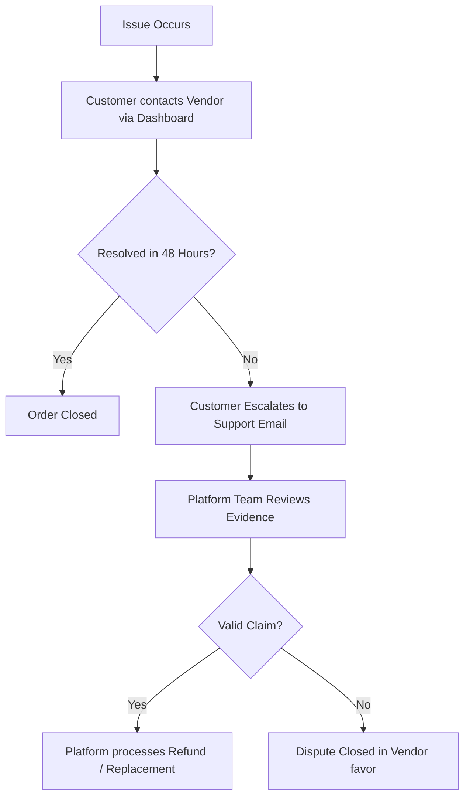

# Buyer Protection Policy

**Effective Date:** [Effective Date]  
**Last Updated:** [Last Updated]

## 1. Introduction
Welcome to ViaCraft ("Platform"). ViaCraft is a multi-vendor online marketplace designed to showcase and sell handcrafted resin products, jewellery, gifts, home decor, and preservation art.

We are committed to providing a secure and reliable shopping experience. This Buyer Protection Policy outlines the guarantees and dispute resolutions available to Customers on [Website URL].

## 2. Purpose
The purpose of this Buyer Protection Policy is to establish trust, outline secure payment guidelines, guarantee refunds for non-delivery or shipping damage, and clarify the steps Customers must take to seek resolution.

## 3. Marketplace Facilitator Framework
> [!IMPORTANT]
> **Facilitator Disclaimer:** ViaCraft is a facilitator connecting buyers with independent sellers. While the Vendor is legally responsible for product creation, quality, and delivery, the Platform provides mediation, payment escrow holds, and dispute handling to protect buyers from fraud.

## 4. Key Buyer Protection Guarantees

### 4.1. Secure Payment Gateway
*   All transactions are processed through certified, SSL-encrypted payment processors.
*   Your credit/debit card, UPI, and banking details are never stored by ViaCraft.

### 4.2. Delivery Guarantees
*   If an item does not arrive, or the Vendor fails to ship the item within the agreed timeline, the Customer is protected.
*   If the tracking indicates a delivery failure or the package is lost by the courier, a **100% refund** will be issued.

### 4.3. Item Condition & Authenticity
*   **Damaged on Arrival:** Since resin items can be fragile, if your order arrives broken, cracked, or chipped, you are entitled to a free replacement or full refund, subject to providing unboxing proof.
*   **Incorrect Item:** If the Vendor ships a product that differs materially in size, color, or design from the description on the Platform, the Customer is protected.

## 5. Dispute Resolution Process
If you experience an issue with an order, follow this process:

## 6. Customer Responsibilities
To claim protection under this policy, the Customer must:
1.  **Report Timely:** Report any issues, defects, or non-delivery within **48 hours** of the delivery date or estimated delivery window.
2.  **Submit Evidence:** Provide a continuous, unedited unboxing video or clear photographs of the package labels and the damaged/incorrect product.
3.  **Ship Returns Safely:** Follow return instructions and package the product securely if asked to return it.

## 7. Vendor Responsibilities
*   **Honest Listings:** Vendors must represent items accurately.
*   **Safe Packaging:** Vendors must use robust transit packaging.
*   **Prompt Resolution:** Vendors must engage in good-faith resolution of Customer disputes within 48 hours.

## 8. Exceptions & Exclusions
Buyer Protection does **not** cover:
*   **Customer Remorse:** Deciding you do not want the item after it has been shipped (especially for custom or preservation orders).
*   **Deliberate Damage:** Items damaged due to Customer misuse, dropping, heat exposure, or altering.
*   **Deliveries to Third Parties:** Shipments successfully delivered to the requested address but claimed as missing after handoff.
*   **Natural Variations:** Minor bubbles or natural wood-grain differences inherent to handmade resin products.

## 9. Limitation of Liability
ViaCraft's liability is strictly limited to the facilitation of transaction resolution and the refund of the purchase price paid. The Platform is not liable for secondary damages, emotional distress, or wedding delay frustrations (for garland preservation orders) arising from Vendor failures.

## 10. Grievance Redressal Officer
If you are unsatisfied with a support decision, you may escalate the issue to our Grievance Officer:
*   **Email:** [Support Email]
*   **Attention:** Grievance Desk - Buyer Protection

## 11. Governing Law
This Buyer Protection Policy is governed by the Consumer Protection Act, 2019, of India.

## 12. Policy Changes
We reserve the right to revise this policy to improve customer safety. Your continued transactions on the Platform signify acceptance of the updated rules.
